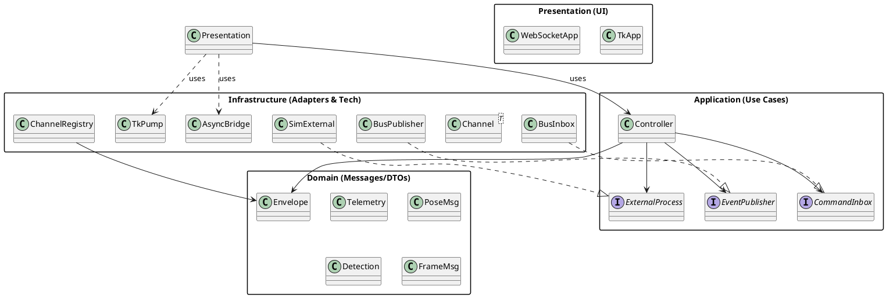

Absolutely — here are compact UML diagrams for the layered version you downloaded, plus the reasoning for why each piece lives in its layer.

---

# UML (PlantUML)

> Copy–paste each block into any PlantUML viewer (or use IntelliJ/VSC plugins).
> They’re high-level and map directly to files in `src/`.

## 1) Package / Component (layer) diagram



## 2) Core class diagram (selected classes & ports)

```plantuml
@startuml
skinparam classAttributeIconSize 0

package Application {
  interface EventPublisher {
    +publish(env: Envelope): void
  }
  interface CommandInbox {
    +drain(): Iterable<Envelope>
  }
  interface ExternalProcess {
    +poll(): Envelope?
  }

  class Controller {
    -period: float
    -_thread
    -_stop
    +start(): void
    +stop(): void
    -_run(): void
    -_handle_command(env: Envelope): void
  }
  Controller --> EventPublisher
  Controller --> CommandInbox
  Controller --> ExternalProcess
}

package Domain {
  class Envelope {
    +topic: str
    +payload: Any
    +ts: float
  }
  class Telemetry { +source: str; +value: float }
  class PoseMsg
  class Detection
  class FrameMsg
}

package Infrastructure {
  class Channel<T> {
    -_q
    +put(item: T): void
    +get(timeout?): T
    +try_drain(): Iterable<T>
  }
  class ChannelRegistry {
    -_by_name: Dict<str, Channel>
    +channel(name: str): Channel
    +names(): List<str>
  }
  class BusPublisher {
    -_ch: Channel<Envelope>
    +publish(env: Envelope): void
  }
  class BusInbox {
    -_ch: Channel<Envelope>
    +drain(): Iterable<Envelope>
  }
  class AsyncBridge {
    -queues: Dict<str, asyncio.Queue<Envelope>>
    +start(): void
    +stop(): awaitable
  }
  class TkPump {
    {static} +tk_pump(root, reg, on_event, every_ms=30)
  }
  class SimExternal {
    +poll(): Envelope?
  }

  BusPublisher ..|> EventPublisher
  BusInbox ..|> CommandInbox
  SimExternal ..|> ExternalProcess
  ChannelRegistry --> Channel
  Channel --> Envelope
}

package Presentation {
  class TkApp {
    +on_event(env: Envelope): void
  }
  class WebSocketApp {
    {static} +run_server(bridge, on_setup) : (server, task)
    {static} +broadcaster(bridge, clients)
  }
  TkApp --> Envelope
  WebSocketApp --> AsyncBridge
}

@enduml
```

## 3) Sequence — Server mode

```plantuml
@startuml
actor Client
participant "WebSocketApp\n(handler)" as WS
participant "AsyncBridge" as AB
participant "ChannelRegistry\n(kpi/setup)" as MB
participant "Controller" as C
participant "SimExternal" as EP

Client -> WS : CONNECT
WS --> Client : "hello"
loop every ~50ms
  C -> EP : poll()
  EP --> C : Envelope(topic='kpi', payload=Telemetry)
  C -> MB : publish(kpi)
  AB -> MB : try_drain(all topics)
  AB --> WS : enqueue KPI to asyncio queue
  WS --> Client : send JSON
end
Client -> WS : text command\n(e.g. setup JSON)
WS -> MB : put Envelope(topic='setup', payload=...)
C -> MB : drain setup
C : apply command
@enduml
```

## 4) Sequence — GUI mode

```plantuml
@startuml
actor User
participant "TkApp\n(main thread)" as TK
participant "TkPump\n(.after)" as TP
participant "ChannelRegistry" as MB
participant "Controller" as C
participant "SimExternal" as EP

loop every ~50ms
  C -> EP : poll()
  EP --> C : Envelope('kpi'/pose/...)
  C -> MB : publish(...)
end

loop every 30ms
  TP -> MB : try_drain()
  TP -> TK : on_event(env)\n(update label)
end

User -> TK : Click "start"
TK -> MB : put Envelope(topic='setup', payload=...)
C -> MB : drain setup
C : apply command
@enduml
```

---

# Why this layering? (short, practical rationale)

## Goals

* **Encapsulate different kinds of complexity** so each part stays small and comprehensible.
* **Localize change** (when a library or technology changes, only one layer moves).
* **Clear responsibilities** (UI vs. use-cases vs. tech).
* **Testability** (application logic testable without tkinter/websockets/event loops).
* **Replaceability** (swap infra or presentation without touching core).

## What lives where — and why

### Presentation (UI)

* **What:** `TkApp`, `websocket_app.run_server`, view models, input parsing.
* **Why:** UI code changes frequently (look & feel, protocols, endpoints). Keeping it here isolates that churn. It depends on **Application ports** (what the app can do) and uses infra helpers (AsyncBridge/TkPump) to connect safely to queues/event loop.
* **Change examples**: Switch from `websockets` to FastAPI/uvicorn; add a second GUI; add REST in parallel. Only Presentation + a smidge of Composition changes.

### Application (Use cases)

* **What:** `Controller` and **ports** (`EventPublisher`, `CommandInbox`, `ExternalProcess`).
* **Why:** This is your stable “brains.” It knows workflows and rules, not *how* I/O happens. Depending on ports makes it **framework-agnostic** and eminently unit-testable (mock the ports).
* **Change examples**: New business rule: change sampling period on a command; merge/transform detections; throttle KPIs. Only `Controller` moves; tests catch regressions quickly.

### Infrastructure (Adapters & Tech)

* **What:** Queue-backed **MessageBus** (`Channel`, `ChannelRegistry`, `BusPublisher`, `BusInbox`), **AsyncBridge**, **TkPump**, **SimExternal** (the I/O adapter).
* **Why:** Technical details (threads, queues, event loops, subprocess/IO) evolve independently from rules and UI. Keeping all bridges/adapters here prevents UI logic or rules from “knowing” about threading primitives.
* **Change examples**: Replace `queue.Queue` with ZeroMQ/gRPC/Kafka; move heavy work to processes; store images to disk/cloud. Only Infrastructure changes; Application and Presentation don’t.

### Domain (DTOs / Messages)

* **What:** `Envelope`, `Telemetry`, `PoseMsg`, `Detection`, `FrameMsg`.
* **Why:** Shared *schema* of information; persists across layers. Keeping them minimal avoids bidirectional dependencies or ORM bleeding into app code.

---

# How this helps with concurrency and async/sync mixing

* **One event loop** (server mode) and **one Tk main thread** (GUI mode), with **queues as bridges**:

  * Application runs in a **background thread**; it never touches Tk or asyncio.
  * **AsyncBridge** mirrors queue items to `asyncio.Queue` for WebSocket broadcasting (no cross-thread awaits).
  * **TkPump** pulls from queues via `root.after(...)` and updates widgets on the Tk thread (no cross-thread UI calls).
* **Backpressure policies per channel** control memory and latency (frames = latest-wins; telemetry = bounded `drop_old`; setup/control = blocking).

---

# Design consequences (concrete scenarios)

* **Swap a technology**: Moving from `websockets` → `FastAPI WebSocket` affects only Presentation and (maybe) a tiny utility in Infra.
* **Add a new output** (e.g., file logger, metrics push): implement `EventPublisher` adapter (Infra) and subscribe—no `Controller` change.
* **Add a new UI** (CLI dashboard; a Qt app): new Presentation module; reuse the same Application + Infrastructure.
* **Scale**: When telemetry rates rise, tune `ChannelConfig` per topic (e.g., `maxsize`, `policy`) without touching logic or UI code.

---

# References (authoritative & stable)

* Python `queue.Queue` (thread-safe, MPMC): Python Stdlib Docs — *queue*
  [https://docs.python.org/3/library/queue.html](https://docs.python.org/3/library/queue.html)
* `asyncio` + threads (thread-safe callbacks, queues): Python Stdlib Docs — *asyncio*
  [https://docs.python.org/3/library/asyncio-eventloop.html#asyncio.loop.call\_soon\_threadsafe](https://docs.python.org/3/library/asyncio-eventloop.html#asyncio.loop.call_soon_threadsafe)
  [https://docs.python.org/3/library/asyncio-queue.html](https://docs.python.org/3/library/asyncio-queue.html)
* Tkinter main-thread updates & `after()` scheduling: Python Stdlib Docs — *tkinter*
  [https://docs.python.org/3/library/tkinter.html#widget.after](https://docs.python.org/3/library/tkinter.html#widget.after)
* `websockets` (v12+) server basics and handler signature:
  [https://websockets.readthedocs.io/en/stable/intro/basic.html](https://websockets.readthedocs.io/en/stable/intro/basic.html)
* Hexagonal Architecture / Ports & Adapters (Cockburn):
  [https://alistair.cockburn.us/hexagonal-architecture/](https://alistair.cockburn.us/hexagonal-architecture/)
* Clean Architecture (dependency rule; stable abstractions):
  Robert C. Martin, “The Clean Architecture” (2012) — [https://8thlight.com/blog/uncle-bob/2012/08/13/the-clean-architecture.html](https://8thlight.com/blog/uncle-bob/2012/08/13/the-clean-architecture.html)

---


```platuml
@startuml
actor Client
participant WebSocketApp as WS
participant AsyncBridge as AB
participant ChannelRegistry as MB
participant Controller as C
participant SimExternal as EP

Client -> WS: CONNECT
WS --> Client: "hello"

loop every ~50ms
  C -> EP: poll()
  EP --> C: Envelope(kpi)
  C -> MB: publish(kpi)
  AB -> MB: try_drain()
  AB --> WS: enqueue KPI
  WS --> Client: send JSON
end

Client -> WS: text command
WS -> MB: put Envelope(setup)
C -> MB: drain setup
C -> C: apply command
@enduml
```